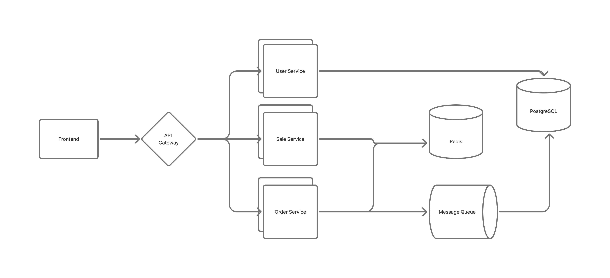

# Take Home Test – Flash Sale

# Summary

### Functional Requirements

- **Configurable flash sale window** — purchases only allowed between start and end timestamps.
- **Single product, limited stock** — fixed quantity available.
- **One item per user** — enforce unique purchase constraint.
- **API server endpoints** (minimum):
    - `GET /sales` — returns sale state (`upcoming | active | ended`) and remaining stock.
    - `POST /orders` — attempt to purchase (requires user identifier).
    - `GET /orders` — check if a user successfully purchased.
- **Frontend requirements**:
    - Show current sale status.
    - User authentication (login/signup).
    - “Buy Now” action.
    - Display purchase result (`success | sold out | sale ended | already purchased | in progress`).

### Non-Functional Requirements

- **Scalability & high throughput** — handle bursts of concurrent purchase attempts.
- **Robustness & fault tolerance** — resilient under failures.
- **Concurrency control** — prevent overselling and enforce “one item per user.”

### Testing Requirements

- Unit tests.
- Integration tests.
- Stress tests (concurrent users, load simulation).

---

## System Diagram

---

## Architecture Components

### Frontend

- React.js application.
- Displays sale status, handles authentication, and manages the purchase flow.

---

### API Gateway

- Cloud service: Managed Google API Gateway / Managed Google Cloud Run
- REST-based gateway.
- Responsibilities:
    - Authentication & authorization.
    - Idempotency check.
    - Rate limiting.
    - Routing requests to backend services.

**Endpoints:**

- `POST /users` — register new user.
- `POST /users/authenticate` — authenticate user.
- `GET /sales` — fetch flash sale item details.
- `POST /sales/update` — update sales .
- `POST /orders` — attempt purchase.
    - Request: `{ product_id: string }`
    - Responses:
        - `200 OK`: `{ order_id, user_id, product_id }`
        - `400 Bad Request`: `{ error: "Product sold out" }`
        - `400 Bad Request`: `{ error: "Already purchased" }`
- `GET /orders` — check purchase result.
    - Responses:
        - `200 OK`: `{ order_id, user_id, product_id, status}`
        - `200 OK`: `{ message: "Failed to purchase" }`

---

### User Service

- Cloud Service: Cloud Run
- Containerized microservice handling user authentication and session management.

---

### Sale Service

- Cloud Service: Cloud Run
- Responsible for sale lifecycle management and real-time availability display.
- Uses **Redis** to store “stock tokens” representing available inventory.
- Ensures accurate, up-to-date stock counts under heavy read traffic.

---

### Order Service

- Cloud Service: Cloud Run
- Handles order creation and enforces **one order per user per product**.
- On successful purchase: consumes one token from Redis (decrement stock).
- On failed order creation: releases token back to Redis.
- Prevents overselling via **atomic token operations** in Redis.

---

### Cloud Task Queue

- A **task queue (e.g., Google Cloud Tasks, AWS SQS, RabbitMQ)** is used to absorb bursty purchase attempts.
- Purpose:
    - Smooth out spikes in traffic by queueing order creation requests.
    - Prevents the database from being overwhelmed by concurrent writes.
- Flow:
    1. User initiates purchase → request validated → stock token reserved in Redis.
    2. Order creation task pushed to the queue.
    3. Order Service consumes tasks sequentially and persists orders into PostgreSQL.
    4. If order creation fails, the token is released back to Redis.

This design allows **instant feedback to users** (“purchase submitted”) while the heavy work is processed asynchronously, ensuring system stability during extreme load.

---

### Redis

- Chosen for **in-memory speed** and ability to handle extremely high concurrent read/writes.
- Use cases:
    - Stock management (token bucket pattern).
    - Sale session data.
    - Idempotency keys to prevent duplicate purchases.

---

### PostgreSQL

- Primary relational database for durable storage of users, sales, and orders.
- Enforces uniqueness via constraints (e.g., unique index on `(user_id, product_id)` in orders table).
- Provides strong consistency guarantees and transactional integrity.

---

## Trade-offs & Justifications

### Redis + PostgreSQL vs. Only PostgreSQL

- **Redis**: Optimized for high-frequency operations (thousands of purchase attempts per second). Provides atomic operations (`INCR`, `DECR`) for stock management.
- **PostgreSQL only**: Would require row-level locks/transactions to prevent oversell, leading to contention and degraded performance.
- **Hybrid**: Redis ensures real-time concurrency control; PostgreSQL ensures long-term durability and consistency.

---

### Task Queue vs. Direct Writes

- **Direct Writes**: Low latency, but under bursty traffic the database can be overloaded, causing timeouts or lock contention.
- **Task Queue**: Buffers requests, ensuring database writes are processed at a controlled rate. Provides elasticity under sudden traffic spikes.
- **Trade-off**: Adds eventual consistency — user may see a short delay before final confirmation. But in flash sales, **fairness and stability** matter more than sub-millisecond latency.

---

### Microservices vs. Monolith

- **Microservices**: Clear separation of concerns (User, Sale, Order). Easier to scale bottlenecks independently. For example, Order Service can be scaled up more aggressively during peak sale traffic.
- **Monolith**: Easier to implement initially, but harder to scale specific components under high concurrency.

---

### PostgreSQL vs. NoSQL

- **PostgreSQL**: Strict uniqueness and referential integrity (critical for enforcing “one per user”).
- **NoSQL**: Could scale horizontally, but uniqueness enforcement is complex and error-prone.

---

## Data Model

### User

| Column   | Description |
| -------- | ----------- |
| user_id  | string (PK) |
| email    | string      |
| password | string      |

### Product

| Column        | Description |
| ------------- | ----------- |
| product_id    | string (PK) |
| name          | string      |
| price_in_cent | int         |
| quantity      | int         |

### FlashSale

| Column        | Description |
| ------------- | ----------- |
| flash_sale_id | string (PK) |
| product_id    | string (FK) |
| start_date    | Date        |
| end_date      | Date        |

### Order

| Column         | Description |
| -------------- | ----------- |
| order_id       | string (PK) |
| product_id     | string (FK) |
| user_id        | string (FK) |
| reserved_token | string      |

---
